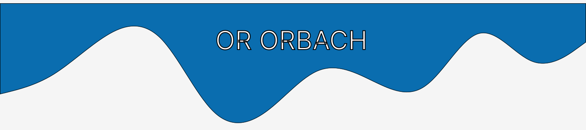

  

---

## 📚 About me

- 🎓 BSc in Computer Science – Full-Stack internship.  
- 🤖 Experienced in building full-stack apps and exploring AI agents & Model Control Protocols (MCP).  
- 🚀 Fast learner and team player.

---

## 💻 Skills

  <!-- C -->
  
  <!-- C++ -->
  
  <!-- Java -->
  
  <!-- JavaScript -->
  
  <!-- TypeScript -->
  
  <!-- Python -->
  
  <!-- HTML5 -->
  
  <!-- CSS3 -->
  
  <!-- MySQL -->
  
  <!-- MongoDB -->
  
  <!-- Linux -->
  
  <!-- React -->
  

---

## 🔗 Connect

  

